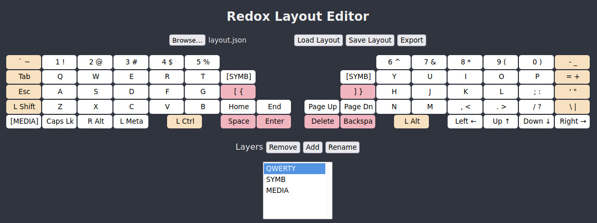

# Redox Layout Editor

A simple web page that allows you to visually modify, save, load, and export
keymaps for the [Redox](https://github.com/mattdibi/redox-keyboard) Rev1
keyboard running [QMK firmware](https://docs.qmk.fm/#/).

## Usage

Either clone this repository and simply open `redox-layout-editor.html` with a
browser, or use the one hosted at http://tilleyd.com/redox-layout-editor.html
(no user data is ever uploaded).

It should be fairly easy to use. Simply click on the buttons and choose what
you want it to do. You can add and remove layers and set buttons to activate
them. Once you're done, save the layout as a JSON file to pick it up again in
future, and export it to create a `keymap.c` source file ready to compile with
QMK.

An example layout is provided in [`example-layout.json`](example-layout.json)
that you can load.

## License

Copyright &copy; 2021 Duncan Tilley.
See the [license notice](LICENSE.txt) for full details.

## Issues

If you see any issues or possible improvements, please open an issue or feel
free to make a pull request.
